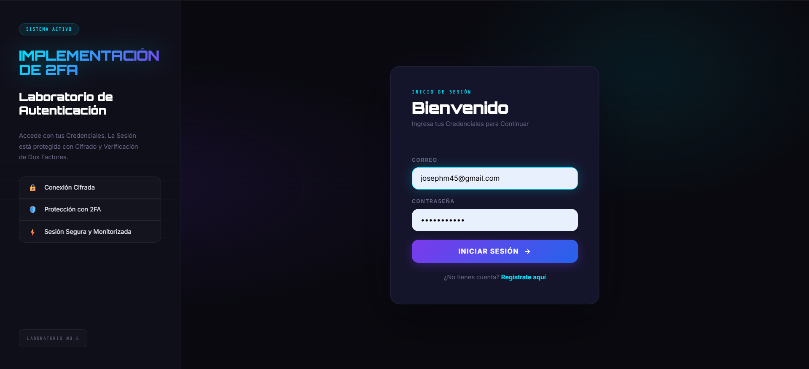
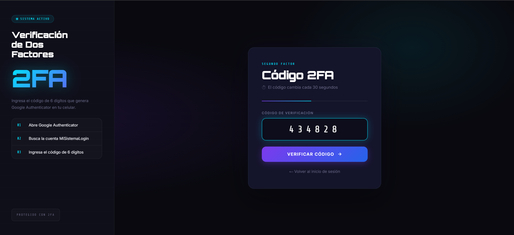
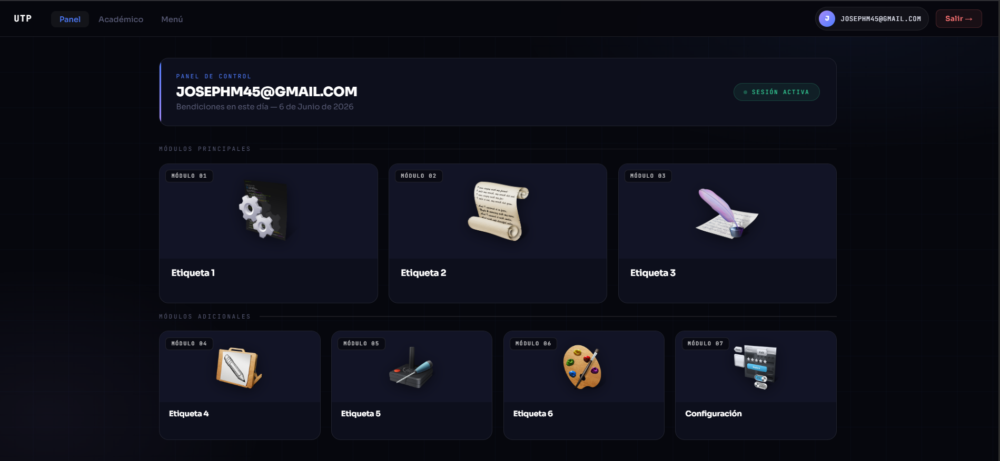

## EjemploLogin — Sistema de Autenticación PHP

**Universidad Tecnológica de Panamá**  
Facultad de Ingeniería de Sistemas Computacionales

---

## 📋 Descripción

Sistema de Inicio de Sesión seguro con registro de usuarios, autenticación de dos factores (2FA) y control de sesiones, desarrollado en PHP con PDO y Composer.

El Proyecto incorpora validación de entradas, protección CSRF, hash de contraseñas y acceso a la base de datos, además de una interfaz clara pensada para un entorno académico y de práctica.

---

## ⚙️ Tecnologías utilizadas

- 🐘 PHP 8.0 o superior
- 📦 Composer
- 🗄️ MySQL
- 💻 WampServer o Xampp
- 📝 Visual Studio Code

---

## 🔧 Instalación

### 1. Clonar el repositorio
```bash
git clone https://github.com/tu-usuario/EjemploLogin.git
```

### 2. Entrar a la carpeta
```bash
cd EjemploLogin
```

### 3. Instalar dependencias
```bash
composer install
```

### 4. Configurar la base de datos
Importa el archivo SQL incluido (company_info) y edita las credenciales en `clases/mysql.inc.php`.


### 5. Dato Importante:
Si vas a usar el segundo factor, instala la aplicación Google Authenticator en tu celular. Esa app se usa para escanear el código QR que genera el sistema durante el registro y para crear los códigos temporales de 6 dígitos.

Además, verifica que el teléfono y el servidor tengan la misma zona horaria. Si la hora no coincide, los códigos pueden fallar aunque el secreto sea correcto.

### 6. Ejecutar el proyecto
Abre tu navegador y accede a:
```
http://localhost/EjemploLogin/login.php
```
---

## 📁 Estructura de archivos

La Estructura está organizada por responsabilidad para que sea fácil ubicar cada parte del sistema.

### Carpetas principales

- `clases/`: contiene la lógica de negocio, conexión a BD y validaciones.
- `comunes/`: guarda funciones y fragmentos reutilizables.
- `formularios/`: contiene vistas y componentes del panel principal.
- `Estilos/`: agrupa todos los archivos CSS del proyecto.
- `img/icons/`: almacena iconos e imágenes usadas en la interfaz.
- `vendor/`: dependencias instaladas por Composer.

### Archivos del sistema

- `login.php`: punto de entrada al inicio de sesión y generador del token CSRF.
- `login_form.php`: formulario visual del login.
- `Autenticacion.php`: validación del código 2FA con Google Authenticator.
- `FormRegistro.php`: formulario de registro de usuarios.
- `ProcesarRegistro.php`: procesa el registro, guarda el secreto 2FA y genera el QR.
- `Panelprincipal.php`: panel principal después de autenticarse.
- `VerificarDuplicado.php`: verifica por AJAX si un correo o usuario ya existe.
- `salir.php`: cierra la sesión del usuario.
- `composer.json`: define la dependencia principal del proyecto.
- `composer.lock`: bloquea las versiones instaladas.
- `README.md`: documentación general del sistema.

### Detalle de la carpeta `clases/`

- `mysql.inc.php`: crea la conexión PDO y centraliza el acceso a MySQL.
- `GestorHash.php`: genera, valida y actualiza hashes de contraseña.
- `objLoginAdmin.php`: autentica usuarios y registra los accesos.
- `Registrese.php`: administra el registro de nuevos usuarios.
- `SanitizarEntrada.php`: limpia y normaliza datos de entrada.

### Detalle de la carpeta `comunes/`

- `loginfunciones.php`: contiene funciones comunes como redirección y mensajes.
- `Cabecera4.php`: cabecera HTML reutilizable.
- `footer.php`: pie de página reutilizable.
- `bloque_Seguridad.php`: bloque de protección para vistas privadas.

### Detalle de la carpeta `formularios/`

- `PanelControl.php`: vista del área protegida.
- `TableroMenu.php`: menú o navegación del panel.

---

## 🔐 Características de Seguridad

- **CSRF tokens** en todos los formularios
- **Autenticación de dos factores (2FA)** con Google Authenticator
- **Hash de contraseñas** con `password_hash()`
- **PDO con prepared statements** para prevenir SQL injection
- **Sanitización de entradas** antes de procesar datos
- **Registro de accesos** e intentos fallidos en base de datos

---

## 🧪 Flujo de Autenticación - Pruebas de Funcionamiento 

### Pantalla de Login

Formulario inicial donde el usuario escribe su correo y contraseña para comenzar el acceso.



---
### Verificación 2FA

Pantalla donde se ingresa el código temporal de Google Authenticator para confirmar la identidad. Ese código se genera en el celular después de escanear el QR creado durante el registro.



---
### Panel Principal

Vista protegida que aparece solo cuando el usuario completó correctamente el login y el segundo factor.



---

## 👤 Información de los Estudiantes

| Campos     | Detalles              |
|------------|-----------------------|
| Nombres    | Carlos Concepción, Joseph Guerra|
| Curso      | Desarrollo de Software VII      |
| Instructor | Irina Fong                      |